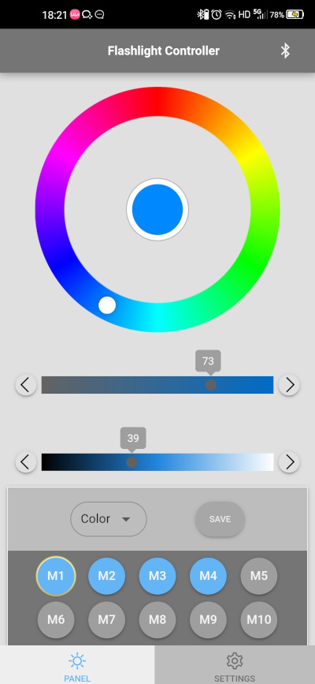

# Light Controller

灯光控制 app 客户端
前段时间做的一个测试 app，目的：以手机 app 通过蓝牙 BLE 远程控制 LED 彩灯颜色，并可以将选定的颜色保存在 M1-M10 十个存储位。
采用 HSL 色彩方案， 控制面板上方一个调色轮选选择基本色调，下面两个滑块选择饱和度和亮度。

采用 Vue 3 + capacitor 架构。

控制面板：



## Install the dependencies

```bash
yarn
# or
npm install
```

### Start the app in development mode (hot-code reloading, error reporting, etc.)

```bash
quasar dev
```

### Lint the files

```bash
yarn lint
# or
npm run lint
```

### Format the files

```bash
yarn format
# or
npm run format
```

### Build the app for production

```bash
quasar build
```

### Customize the configuration

See [Configuring quasar.config.js](https://v2.quasar.dev/quasar-cli-webpack/quasar-config-js).
